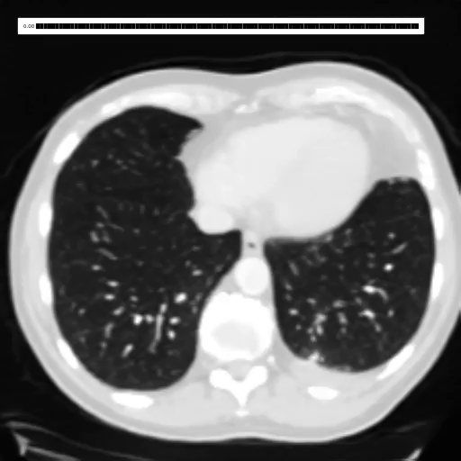
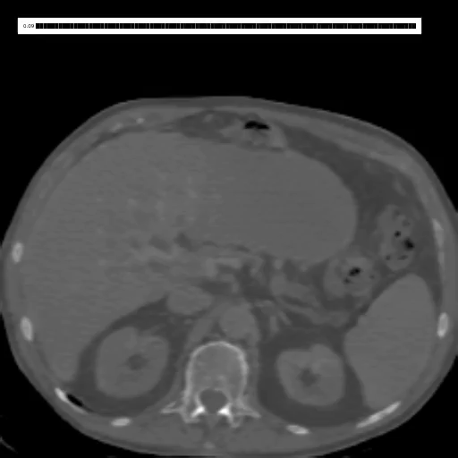

# CT Counterfactuals

The code and models here were used in the Paper [📄 Merlin: A Vision Language Foundation Model for 3D Computed Tomography
](https://arxiv.org/abs/2406.06512).

## Models

A 1692 target classifier predicting phenotypes from CT scans
```
import ct_counterfactuals as ct_cf
clf = ct_cf.classifiers.phecode2.PheCodeClassifier()
x = torch.ones([1, 1, 224, 224, 174])
out = clf(x)
out.shape # [1, 1692]
```

A VQ-GAN autoencoder trained on X
```
import ct_counterfactuals as ct_cf
ae = ct_cf.ae.VQGAN(weights='2023-12-25T10-26-40_ct2_vqgan256_sddd')
x = torch.ones([1, 1, 224, 224, 174])
out = ae(x)
out.shape # [1, 1, 224, 224, 174]
```

## Example CF explainations of the classifier

| Effusion (fluid in lungs) | Splenomegaly (enlarged spleen)|
| ----------- | ----------- |
|  |   | 
