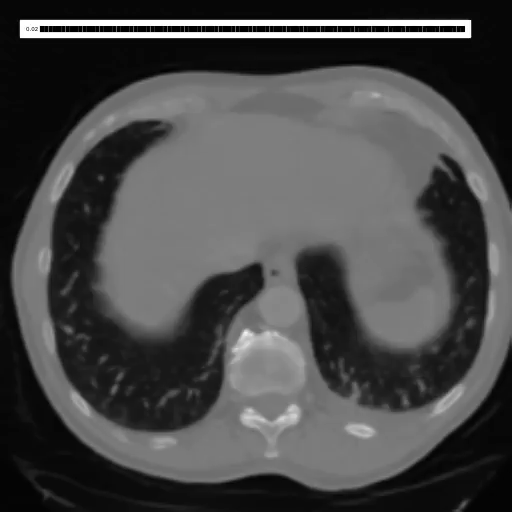

# Computed Tomography Counterfactuals

This repo contains code and models to generate counterfactual images (modifying the images so a classifier will not predict positive for a class) for 3D Computed Tomography volumes. The method used is [Latent Shift](https://arxiv.org/abs/2102.09475).

This code was used in the paper [📄 Merlin: A Vision Language Foundation Model for 3D Computed Tomography
](https://arxiv.org/abs/2406.06512).

## Example CF explainations of the classifier

| Pleural Effusion (fluid in lungs) | Splenomegaly (enlarged spleen)| Lung Size |
| ----------- | ----------- |----------- |
|  |   |  |

## Demos

Pleural Effusion Classification
[](https://colab.research.google.com/github/ieee8023/ct-counterfactuals/blob/main/pleural-effusion.ipynb)

Lung Segmentation Size Prediction
[](https://colab.research.google.com/github/ieee8023/ct-counterfactuals/blob/main/lung-size.ipynb)


## Classifiers

A 1692 target classifier predicting phenotypes from CT scans. From [Merlin](https://arxiv.org/abs/2406.06512).
```python
import ct_counterfactuals as ct_cf
model = ct_cf.classifiers.phecode.PheCodeClassifier()
x = torch.ones([1, 1, 224, 224, 174])
out = model(x)
out.shape # [1, 1692]
```

A lung segmentation model from CT slices
```python
import ct_counterfactuals as ct_cf
model = ct_cf.classifiers.lungmask.LungMaskSegmenter()
x = torch.ones([1, 1, 224, 224, 174])
out = model(x)
out.shape # [1, 3, 224, 224, 1]

# Channels
# 0 = No lung
# 1 = Right lung
# 2 = Left lung
```

## Autoencoders

A VQ-GAN autoencoder trained on CT slices
```python
import ct_counterfactuals as ct_cf
ae = ct_cf.ae.VQGAN(weights='2023-12-25T10-26-40_ct2_vqgan256_sddd')
x = torch.ones([1, 1, 224, 224])
out = ae(x)
out.shape # [1, 1, 224, 224]
```

Utility code is provided to encode 3D volumes
```python
import ct_counterfactuals as ct_cf
ae = ct_cf.ae.VQGAN(weights='2023-12-25T10-26-40_ct2_vqgan256_sddd')

slice_ae = SliceAEFull(ae, 45, 55) # range specified is where gradients can propigate
x = torch.ones([1, 1, 224, 224, 174])
out = ae(x)
out.shape # [1, 1, 224, 224, 174]
```

## PIP install

```
pip install ct-counterfactuals
```
